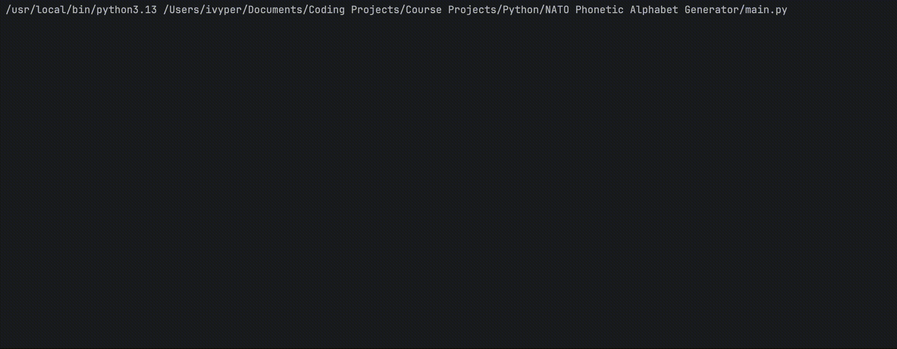

# NATO Phonetic Alphabet Generator

## Project Description
The NATO Phonetic Alphabet Generator converts any word you type into its corresponding NATO code words (e.g., `HELLO` → `["Hotel", "Echo", "Lima", "Lima", "Oscar"]`). It reads a CSV file containing the standard letter-to-code mappings, builds a lookup dictionary, and then prompts you repeatedly until you enter a valid alphabetic string. Non-letter inputs are caught and you’ll be asked to try again.

## Features
- **Data-Driven**: Reads the official NATO alphabet from `nato_phonetic_alphabet.csv` so you can easily update or extend the mapping.
- **Input Validation Loop**: Continuously prompts until you type a string containing only letters; non-alphabetic characters trigger a friendly error message and a retry.
- **Case-Insensitive**: Automatically converts your input to uppercase to match the CSV keys.
- **Clean Output**: Prints the resulting list of code words for your word.

## Prerequisites
- **Python 3.x**  
- **pandas** library  

## Installation
1. **Clone or download** this repository to your local machine.  
2. **Install pandas** (if not already installed):  
   ```bash
   pip install pandas
   ```

## How to Run
1. Open a terminal (or command prompt) and navigate to the directory containing:
   - `main.py`  
   - `nato_phonetic_alphabet.csv`  
2. Run the script:
   ```bash
   python main.py
   ```
3. When prompted, type a single word (letters only) and press Enter.  
4. If you include any non-letter character, you’ll see:
   ```
   Sorry, only letters in the alphabet are allowed.
   ```
   Then you’ll be prompted again.

## Demo

## Usage Example
```
Enter a word: Hello123
Sorry, only letters in the alphabet are allowed.

Enter a word: Python
['Papa', 'Yankee', 'Tango', 'Hotel', 'Oscar', 'November']
```

## Project Structure
```
NATO Phonetic Alphabet Generator/
├── nato_phonetic_alphabet.csv   # CSV mapping letters to code words
├── main.py                      # Loads CSV, loops for valid input, outputs code words
├── LICENSE                      # MIT License
├── .gitignore                   # Common ignores (e.g., __pycache__)
└── README.md                    # This documentation
```

## License
This project is licensed under the [MIT License](https://choosealicense.com/licenses/mit/).

## Author
- **Ivis Perdomo** ([ivyper](https://github.com/ivyper))