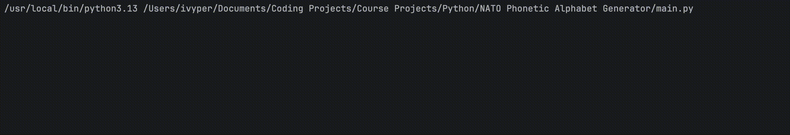

# NATO Phonetic Alphabet Generator

## Project Description
The NATO Phonetic Alphabet Generator is a simple Python utility that converts any word you type into its corresponding NATO code words (e.g., “HELLO” → `[“Hotel”, “Echo”, “Lima”, “Lima”, “Oscar”]`). It reads a CSV file containing the standard letter-to-code mappings, builds a lookup dictionary, and then prompts you to enter a word. Non-alphabet characters are ignored automatically.

## Features
- **Data-Driven**: Reads the NATO alphabet from `nato_phonetic_alphabet.csv`, making it easy to update or extend.
- **Case-Insensitive**: Automatically converts input to uppercase to match the CSV keys.
- **Robust**: Skips non-letter characters rather than throwing errors.
- **List Output**: Returns a Python list of code words for easy further processing.

## Prerequisites
- **Python 3.x**  
- **pandas** library  

## Installation

1. **Clone or download** this repository to your local machine.  
2. **Install pandas** (if not already installed):  
   ```bash
   pip install pandas
   ```

## How to Run

1. Open a terminal or command prompt and navigate to the project directory (where `main.py` and `nato_phonetic_alphabet.csv` reside).  
2. Run the script:
   ```bash
   python main.py
   ```
3. When prompted, type any word and press Enter. The script will print a list of the corresponding NATO code words.

## Usage Example

```
Enter a word: Hello, World!
['Hotel', 'Echo', 'Lima', 'Lima', 'Oscar', 'Whiskey', 'Oscar', 'Romeo', 'Lima', 'Delta']
```



## Project Structure

```
NATO Phonetic Alphabet Generator/
├── nato_phonetic_alphabet.csv   # CSV mapping letters to code words
├── main.py                      # Script to load CSV, prompt user, and output code words
├── LICENSE                      # MIT License
├── .gitignore                   # Common ignores (e.g., __pycache__)
└── README.md                    # This documentation
```

## License
This project is licensed under the [MIT License](https://choosealicense.com/licenses/mit/).

## Author
- **Ivis Perdomo** ([ivyper](https://github.com/ivyper))
